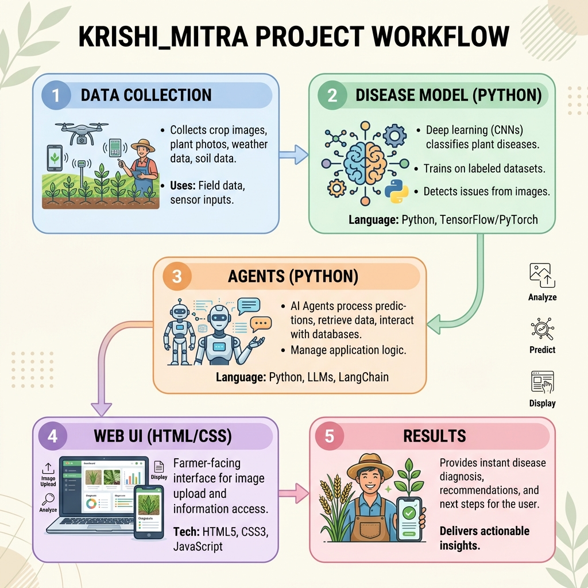

# Krishi_mitra 🌾

## Project Overview
**Krishi_mitra** is a comprehensive solution for agricultural disease monitoring and management.  It combines data collection, a Python‑based disease prediction model, intelligent agents, and a lightweight web UI to help farmers and agronomists make data‑driven decisions.

---

## Workflow Diagram



---

## Repository Structure
```
├── index.html          # Simple web UI entry point
├── styles.css          # UI styling (modern, responsive design)
├── krishi_mitra.py     # Main application script
├── disease_model.py    # Python model for disease prediction
├── agents.py           # Agent logic for recommendations
├── requirements.txt    # Python dependencies
└── assets/
    └── workflow_diagram.png  # Project workflow illustration
```

---

## Getting Started
1. **Clone the repository**
   ```bash
   git clone https://github.com/salinid1999-svg/Krishi_mitra.git
   cd Krishi_mitra
   ```
2. **Install dependencies**
   ```bash
   pip install -r requirements.txt
   ```
3. **Run the web UI**
   ```bash
   python krishi_mitra.py
   ```
   Open `index.html` in a browser to view the UI.

---

## Contributing
Feel free to open issues or submit pull requests.  Contributions that improve the disease model, add new agents, or enhance the UI are welcome.

---

*© 2026 Krishi_mitra – All rights reserved.*
